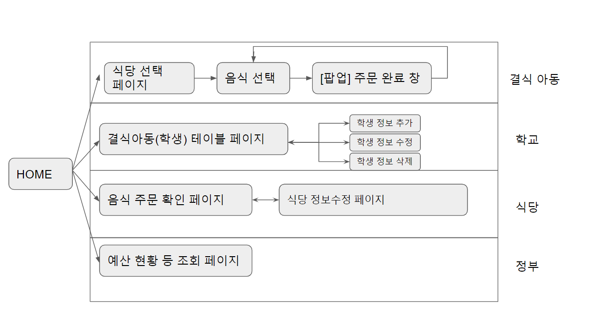
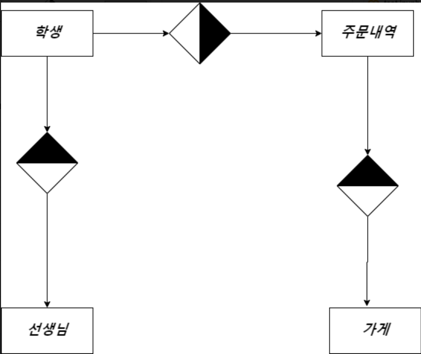

# 서비스 개요

1. 지원이 필요한 아이들이 통합 지원 웹사이트에 접속해서 꿈자람 카드로 음식을 주문할 수 있도록 해준다.

2. 가맹점(식당)은 통합 사이트를 통해서 주문을 확인하고 주소지로 배달한다.

3. 학교의 선생님(혹은 담당자)는 통합 지원 서비스를 통한 학생 모니터링을 통해 온라인 수업이 진행되더라도 아이들이 식사를 제대로 하고 있는지 확인 할 수 있다.

4. 부처 담당자는 구별, 학교별 사업의 진행 상황을 알 수 있다.

   

# 웹 페이지 Flow Chart



# ER-다이어그램



# DB 구조

### 학생(Student)

학생 - > 식당(주문)

ID   이름   주소   연락처   관리자ID

```
CREATE TABLE IF NOT EXISTS `STUDENT` (
`ST_INDEX` INT UNSIGNED AUTO_INCREMENT, /* 학생 ID */
`ST_NAME` VARCHAR(12) NOT NULL DEFAULT '', /* 학생 이름 */
`ST_ADDRESS` VARCHAR(255) NOT NULL DEFAULT '', /* 학생 주소 */
`ST_PHONE` VARCHAR(20) NOT NULL DEFAULT '', /* 학생 연락처 */
`ST_ADMIN_INDEX` INT UNSIGNED NOT NULL DEFAULT 0, /* -> 관리자 ID */
PRIMARY KEY (`ST_INDEX`)
) ENGINE=InnoDB;
```

### 식당(Store)

식당 -> 주문내역

ID   이름   연락처   주소   {메뉴명   가격}

```
CREATE TABLE IF NOT EXISTS `STORE` (
`SE_INDEX` INT UNSIGNED AUTO_INCREMENT, /* 가게 ID */
`SE_NAME` VARCHAR(255) NOT NULL DEFAULT '', /* 가게명 */
`SE_ADDRESS` VARCHAR(255) NOT NULL DEFAULT '', /* 가게 주소 */
`SE_PHONE` VARCHAR(20) NOT NULL DEFAULT '', /* 가게 연락처 */
`SE_MENU` LONGTEXT NOT NULL DEFAULT '{"info": []}', /* 가게 메뉴, 가격 */
PRIMARY KEY (`SE_INDEX`)
) ENGINE=InnoDB;
```

### 주문내역(Order)

ID   학생ID   식당ID   메뉴   주문시각   배달완료시각

```
CREATE TABLE IF NOT EXISTS `ORDER` (
`OR_INDEX` INT UNSIGNED AUTO_INCREMENT, /* 주문 ID */
`OR_STUDENT_INDEX` INT UNSIGNED NOT NULL DEFAULT 0, /* 학생 ID */
`OR_STORE_ID` INT UNSIGNED NOT NULL DEFAULT 0, /* 가게 ID */
`OR_ORDER_LIST` LONGTEXT NOT NULL DEFAULT '{"info": []}', /* 주문내역 */
`OR_ORDER_TIME` DATETIME NOT NULL DEFAULT '1990-01-01 00:00:00', /* 주문시간 */
`OR_DELIVER_TIME` DATETIME NOT NULL DEFAULT '1990-01-01 00:00:00', /* 주문시간 */
`OR_STATE` TINYINT UNSIGNED NOT NULL, /* 주문 ID */
PRIMARY KEY (`OR_INDEX`)
) ENGINE=InnoDB;
```

### 관리자(Admin)

ID   이름   연락처

```
CREATE TABLE IF NOT EXISTS `ADMIN` (
`AD_INDEX` INT UNSIGNED AUTO_INCREMENT, /* 관리자 ID */
`AD_NAME` VARCHAR(12) NOT NULL DEFAULT '', /* 관리자 이름 */
`AD_PHONE` VARCHAR(20) NOT NULL DEFAULT '', /* 관리자 연락처 */
PRIMARY KEY (`AD_INDEX`)
) ENGINE=InnoDB;
```


